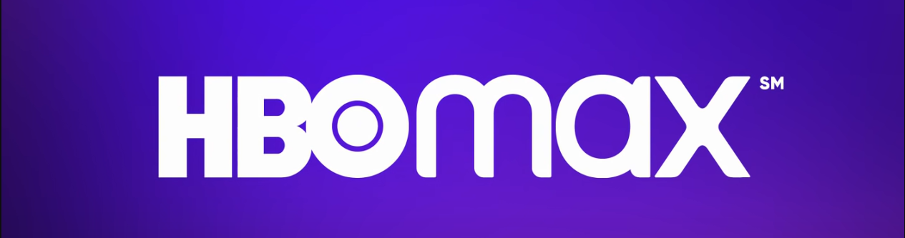

<h1 align="center">Site HBO Max</h1>

  O projeto é um clone do site <a href="https://www.hbomax.com/br/pt">HBO Max</a>, com o intuito de reproduzir a interface, com algumas modificações, aplicando os temas abordados ao longo das aulas de CSS da plataforma da <a href="https://dio.me">Digital Innovation One</a>.

  O clone do site HBO Max serve como desafio para os alunos da plataforma testarem seus conhecimentos e colocarem em prática os recursos de HTML e CSS abordados nos cursos.

<h2 id="demo">🌈 Desafio Finalizado</h2>

Você pode acessar ao resultado final do projeto [clicando aqui](https://cibely87.github.io/hbomax/).

---
por [Cibely Pereira](https://github.com/cibely87) 😊
